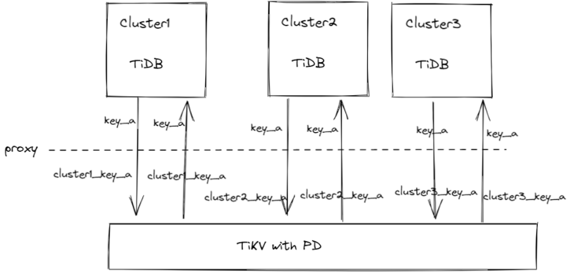
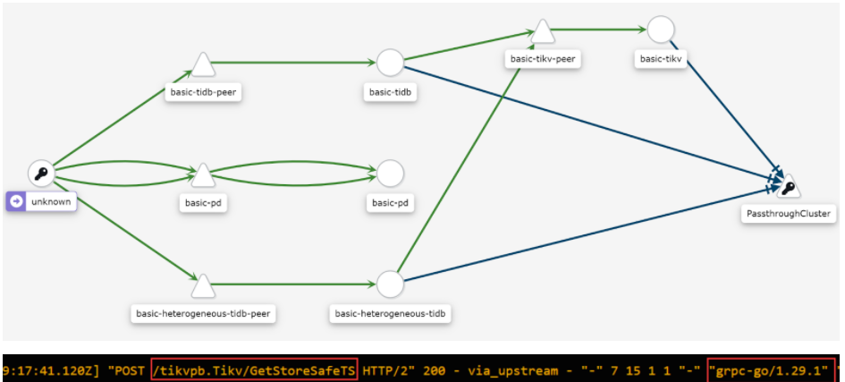

# TiDB Mesh: Implement Multi-Tenant Keyspace by Decorating Message between Components

There’s a traditional thinking paradigm in TiDB multi-tenant features design, which is that we would do too much code refactoring to support multi-tenant, and we would maintain a new code pattern for both single-tenant and multi-tenant features. These refactoring works seem unaffordable for the current development resources.

Actually, large-scale code refactoring is not necessary. There are not only code generators for clients and servers, but also messages in the network traffic. We can pay more attention to the network traffic of gRPC, rather than how to produce gRPC messages and receive gRPC messages.

In the traditional way, we have to modify the definition in protobuf, or introduce a new set of API in protobuf to support multi-tenancy, such as the keyspace support for TiKV. And then, we use the code generator to update the codes for clients and servers, fix errors that arise after the updates, implement the multi-tenancy logic around the updated functions, and make the system runnable. 

If we focus on the gRPC messages in network traffic, things could be easier. We can just decorate the gRPC messages that are used for the key-value-related requests. We can make full use of the information of source and destination, embed the cluster information in the key-value requests.

Let’s think about a simple version of keyspace implementation. We can add or remove a prefix at the head of the key in every k/v request across components. When TiDB puts a key-value pair to TiKV, we can add the prefix to the key, and when we fetch this key-value pair from TiKV, we remove the prefix. The message decoration is transparent for TiDB, and TiKV with PD can store many sets of TiDB key-value pairs without conflicts. If TiKV implements the keyspaces feature as some other design documents, we can also use some params serving for keyspace, instead of the key prefix.

The procedure shows as the graph, key_a is a duplicated key for TiKV, which represents the common issues when multisets of TiDB use the same storage layer. There’s a transparent proxy layer that decorates the content about the key in the gRPC message. It can be implemented by Istio or a dedicated gRPC Proxy service.



The source and destination information are clear in the service mesh system, such as Istio. We can get the component name, which embeds the cluster name, and the method of the gRPC. The information could decide what prefix should be used in decorating.


We can use the heterogeneous feature in TiDB Operator to deploy the cluster. There are a set of examples for TiDBClusters.
 
```yaml
apiVersion: pingcap.com/v1alpha1
kind: TidbCluster
metadata:
  name: storage-layer
spec:
  version: v5.2.1
  pd:
    baseImage: pingcap/pd
    replicas: 1
    requests:
      storage: "1Gi"
    config: {}
  tikv:
    baseImage: pingcap/tikv
    replicas: 1
    requests:
      storage: "1Gi"
    config: {}
---
apiVersion: pingcap.com/v1alpha1
kind: TidbCluster
metadata:
  name: cluster1
spec:
  version: v5.2.1
  cluster:
    name: storage-layer
  tidb:
    baseImage: pingcap/tidb
    replicas: 1
    service:
      type: ClusterIP
    config: {}
---
apiVersion: pingcap.com/v1alpha1
kind: TidbCluster
metadata:
  name: cluster2
spec:
  version: v5.2.1
  cluster:
    name: storage-layer
  tidb:
    baseImage: pingcap/tidb
    replicas: 1
    service:
      type: ClusterIP
    config: {}
```

There must be many problems in this implementation, such as the decoration of coprocessors and some other features supported. We can support these features step by step. If the system works as expected, we would have a universal storage layer, and a dedicated computing layer. It brings us closer to the serverless database. 

Service Mesh is a big topic in TiDB. Once we introduce the service mesh into TiDB, not only we can get the multi-tenant feature, but also we can strengthen the observability of the distributed system. There’re many more accurate network traffic management methods we can use in the future.
